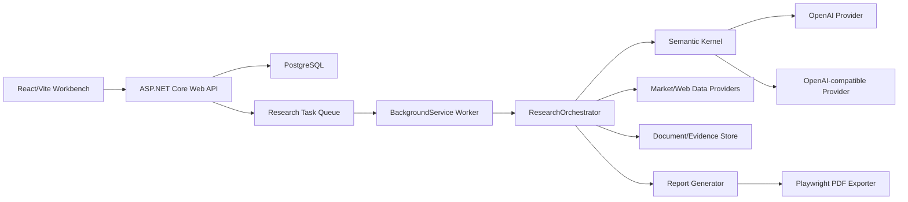

# Stock Research Agent Design

Date: 2026-06-16

## Goal

Build a .NET 10 stock research agent for A-share and Hong Kong stock deep research. A user enters a stock code, the system runs a multi-stage research workflow, and the final output is a Chinese scoring/rating style research report with source citations and optional PDF export.

The first version is a modular monolith with a separate web frontend:

- ASP.NET Core Web API backend.
- React + TypeScript + Vite frontend.
- Built-in background worker and task queue.
- PostgreSQL persistence.
- Microsoft Semantic Kernel for AI/tool orchestration.
- Pluggable OpenAI and OpenAI-compatible model providers.

The report is for research assistance only. The first version outputs scores, ratings, risk levels, valuation observations, assumptions, and evidence. It does not issue direct buy/hold/sell investment instructions.

## Product Scope

### In Scope

- Support A-share and Hong Kong stock codes.
- Research workbench UI with task submission, queue/history, progress, report reader, evidence drawer, and PDF export.
- Multi-task queue with background execution.
- Chinese report output by default, with language configuration reserved.
- OpenAI and domestic OpenAI-compatible model support.
- Free/public data source first, with interfaces reserved for paid financial data providers.
- Public web/search + structured data hybrid research.
- Local document ingestion, evidence indexing, evidence compression, and context budget control.
- PDF export after report generation.
- Open-source/free software stack where practical.

### Out of Scope For First Version

- Multi-user login, permissions, and team sharing.
- Buy/sell trading execution.
- Direct investment recommendation wording such as "buy", "sell", or "target price as instruction".
- Fully automated paid-provider integrations such as Wind or JQData.
- Investment-bank grade PDF layout templates.
- Distributed worker fleet, external message broker, or microservices.

## Architecture

The first version uses a modular monolith:

The backend owns long-running state, retries, persistence, and report generation. Semantic Kernel owns AI-side prompt/function/plugin orchestration, but it does not own the durable task state machine.

## Recommended Technology Stack

### Backend

- .NET 10 / C# 14.
- ASP.NET Core 10 Web API.
- HostedService / BackgroundService.
- System.Threading.Channels for the in-process queue.
- EF Core 10.
- PostgreSQL.
- Npgsql.
- SignalR.
- Serilog.
- OpenTelemetry.
- Polly.
- Microsoft.Playwright .NET for Chromium HTML-to-PDF export.

### Frontend

- React.
- TypeScript.
- Vite.
- TanStack Query.
- React Router.
- Tailwind CSS.
- shadcn/ui.
- Markdown/HTML report renderer.
- SignalR client with polling fallback.

### AI And Agent Orchestration

- Microsoft.SemanticKernel.
- Semantic Kernel plugins for research tools.
- Optional Semantic Kernel agent packages for bounded specialist agents.
- Do not depend on experimental Semantic Kernel Agent Orchestration as a first-version core runtime.
- OpenAI .NET SDK for OpenAI provider integration where it fits.
- HttpClient-based OpenAI-compatible adapter for domestic providers.
- JSON Schema / structured outputs for model-produced scores, evidence lists, and report sections.

### Data And Parsing

- IMarketDataProvider abstraction for market, valuation, financial, and company profile data.
- IWebResearchProvider abstraction for public web/search and disclosure sources.
- AngleSharp or HtmlAgilityPack for HTML parsing.
- PdfPig for annual/interim report PDF text extraction.
- PostgreSQL full-text search for first-version evidence retrieval.
- Optional pgvector later for vector retrieval.

### Tests And Local Tooling

- xUnit.
- WebApplicationFactory.
- Testcontainers for PostgreSQL integration tests.
- Vitest for frontend unit tests.
- Playwright for key frontend flows.
- Docker Compose for local PostgreSQL and app startup.

### Open-Source And Cost Boundary

The software stack is selected to be open-source/free where practical:

- .NET, ASP.NET Core, EF Core, React, Vite, Tailwind CSS, TanStack Query, Semantic Kernel, OpenAI .NET SDK, Microsoft.Playwright .NET, Npgsql, Serilog, OpenTelemetry, Polly, AngleSharp/HtmlAgilityPack, PdfPig, xUnit, and PostgreSQL all have permissive or free/open-source licenses.
- QuestPDF is not the default PDF choice because its licensing is not unconditional for all commercial situations.
- GitHub Actions is not required for first version because it is a hosted service with free quotas rather than a purely open-source local dependency.
- OpenAI API and domestic OpenAI-compatible model APIs are external paid services unless configured to use local/free providers.
- Wind, JQData, Tushare Pro, and similar data sources are future optional paid providers, not required for first version.

References checked during design:

- .NET runtime license: https://github.com/dotnet/runtime/blob/main/LICENSE.TXT
- EF Core license: https://github.com/dotnet/efcore/blob/main/LICENSE.txt
- PostgreSQL license: https://www.postgresql.org/about/licence/
- React license: https://github.com/facebook/react/blob/main/LICENSE
- Tailwind CSS license: https://github.com/tailwindlabs/tailwindcss/blob/main/LICENSE
- Microsoft Semantic Kernel overview: https://learn.microsoft.com/en-us/semantic-kernel/overview/
- Semantic Kernel license: https://github.com/microsoft/semantic-kernel/blob/main/LICENSE
- Semantic Kernel agent orchestration: https://learn.microsoft.com/en-us/semantic-kernel/frameworks/agent/agent-orchestration/
- OpenAI Responses/API tool direction: https://developers.openai.com/api/docs/guides/responses-vs-chat-completions
- OpenAI file search/context references: https://developers.openai.com/api/docs/guides/tools-file-search

## Agent Orchestration Design

Use a hybrid model:

- ResearchOrchestrator is custom .NET code.
- Semantic Kernel is the AI middleware.
- Model providers are pluggable.
- Research tools are registered as Semantic Kernel plugins and as internal C# services.

ResearchOrchestrator responsibilities:

- Durable state machine.
- Queue consumption.
- Stage transitions.
- Step-level retries.
- Step output persistence.
- Context budget enforcement.
- Report and PDF pipeline coordination.

Semantic Kernel responsibilities:

- Prompt templates.
- Function calling / plugin invocation.
- Model connection abstraction.
- Specialist analysis calls.
- Structured output generation.

The first version uses a "manager plus specialist tools" pattern. The manager is the ResearchOrchestrator, and bounded specialist tools/agents handle financial quality, business analysis, valuation, risk, and citation checking. This keeps long-running execution deterministic while still using AI for reasoning-heavy steps.

## Research Pipeline

Each research task follows a recoverable pipeline:

1. NormalizeTicker
   - Parse ticker and market.
   - Normalize examples such as `600519.SH` and `00700.HK`.
   - Reject unsupported or ambiguous symbols.

2. CollectStructuredData
   - Fetch company profile, market data, valuation data, and financial summary.
   - Use IMarketDataProvider.
   - Save data snapshots and source metadata.

3. CollectPublicEvidence
   - Search and fetch announcements, annual/interim reports, exchange disclosures, official company materials, and relevant news.
   - Save original source records and parsed text.
   - Do not send all raw documents to the model.

4. IngestAndIndexDocuments
   - Parse HTML/PDF documents.
   - Chunk documents into bounded text blocks.
   - Index chunks for keyword retrieval.
   - Generate evidence cards from important chunks.

5. AnalyzeWithSemanticKernel
   - Register research tools as SK plugins.
   - Run bounded financial, business, valuation, risk, and citation analysis steps.
   - Each step receives only relevant evidence cards and selected raw snippets.

6. ScoreAndRate
   - Generate structured ratings:
     - Overall score.
     - Financial quality score.
     - Growth score.
     - Valuation attractiveness score.
     - Risk level.
     - Confidence.
     - Key assumptions.
   - Avoid direct buy/sell language.

7. GenerateReport
   - Generate Chinese Markdown report.
   - Include scoring explanation, evidence-backed claims, risk notes, source citations, model/provider info, and data cutoff.

8. ExportPdf
   - Convert report HTML to PDF via Playwright/Chromium.
   - Run in background.
   - Save PDF status and file path.

## Task State Machine

ResearchTask states:

- Queued.
- Running.
- CollectingData.
- IngestingDocuments.
- Analyzing.
- GeneratingReport.
- Ready.
- ExportingPdf.
- Completed.
- Failed.
- Cancelled.

ResearchStep records each stage independently:

- Step name.
- Status.
- Start/end time.
- Retry count.
- Input summary.
- Output summary.
- Error details.

Failures should be retryable at the failed stage when possible.

## Context Management And Evidence Strategy

The system must not push a large document corpus into a single model context. Large documents go into storage and indexes. Model calls receive only small, ranked evidence packs.

### Document Store

Save original materials and metadata:

- URL.
- Title.
- Source type.
- Publisher.
- Published date.
- Retrieved date.
- Hash.
- Raw content path.
- Parsed content path.

### Chunking

Documents are split into bounded chunks:

- Approximately 800-1500 Chinese characters per chunk.
- Preserve document ID, page, section, heading, source type, and date.
- De-duplicate near-identical content.

### Retrieval

Use hybrid retrieval:

- PostgreSQL full-text search for first version.
- Source priority weighting:
  - Exchange filings and annual/interim reports.
  - Company official materials.
  - Trusted financial news.
  - General web pages.
- Recency weighting.
- Market-specific source weighting.

### Evidence Cards

Important chunks are compressed into EvidenceCard records:

- Claim.
- Metric or topic.
- Short snippet.
- Source ID.
- Source title.
- Source URL.
- Date.
- Confidence.
- Relevance.
- Related report section.

### ContextBudgetManager

Every model call has a hard budget:

- Max evidence cards.
- Max raw snippets.
- Max source documents.
- Max approximate tokens/characters.

If a step exceeds budget, the retriever re-ranks or summarizes before the model call. A model call must never receive a whole document set.

### Map-Reduce Analysis

The research workflow summarizes in layers:

- Document/chunk level summary.
- Source-level summary.
- Topic-level summary.
- Final report synthesis.

This enables stage 3 to inspect many documents without overflowing a model context.

## Domain Model

### ResearchTask

- Id.
- Ticker.
- Market.
- CompanyName.
- Status.
- CurrentStage.
- ProgressPercent.
- ErrorMessage.
- CreatedAt.
- UpdatedAt.

### ResearchStep

- Id.
- ResearchTaskId.
- StepName.
- Status.
- RetryCount.
- StartedAt.
- CompletedAt.
- InputSummary.
- OutputSummary.
- ErrorMessage.

### DocumentSource

- Id.
- ResearchTaskId.
- Url.
- Title.
- SourceType.
- Publisher.
- PublishedAt.
- RetrievedAt.
- ContentHash.
- RawContentPath.
- ParsedContentPath.

### DocumentChunk

- Id.
- DocumentSourceId.
- ChunkIndex.
- PageNumber.
- SectionTitle.
- Text.
- TokenEstimate.
- CreatedAt.

### EvidenceCard

- Id.
- ResearchTaskId.
- DocumentSourceId.
- DocumentChunkId.
- Claim.
- Metric.
- Snippet.
- Confidence.
- Relevance.
- SourceDate.
- ReportSection.

### ResearchReport

- Id.
- ResearchTaskId.
- Language.
- Markdown.
- Html.
- RatingJson.
- DataCutoffAt.
- ModelProvider.
- ModelName.
- CreatedAt.

### PdfExport

- Id.
- ResearchTaskId.
- Status.
- FilePath.
- RequestedAt.
- CompletedAt.
- ErrorMessage.

### ModelInvocation

- Id.
- ResearchTaskId.
- StepName.
- Provider.
- ModelName.
- PromptTokens.
- CompletionTokens.
- DurationMs.
- Status.
- ErrorMessage.
- CreatedAt.

### AppSetting

- Id.
- SettingKey.
- SettingValueJson.
- UpdatedAt.

## API Design

### Research Tasks

- `POST /api/research-tasks`
  - Create a research task.
  - Input: ticker, optional market, optional language.

- `GET /api/research-tasks`
  - List queued/running/completed tasks.

- `GET /api/research-tasks/{id}`
  - Get task detail and progress.

- `POST /api/research-tasks/{id}/retry`
  - Retry the failed stage.

- `POST /api/research-tasks/{id}/cancel`
  - Cancel queued or running task where possible.

### Reports

- `GET /api/research-tasks/{id}/report`
  - Get report markdown/html, score JSON, and citation metadata.

- `GET /api/research-tasks/{id}/evidence`
  - Get evidence cards.

- `GET /api/evidence/{id}/source`
  - Get source metadata and source link.

### PDF

- `POST /api/research-tasks/{id}/pdf`
  - Start PDF export.

- `GET /api/research-tasks/{id}/pdf`
  - Get PDF export status or download metadata.

- `GET /api/research-tasks/{id}/pdf/download`
  - Download completed PDF.

### Settings And Health

- `GET /api/settings/providers`
- `PUT /api/settings/providers`
- `GET /api/settings/research`
- `PUT /api/settings/research`
- `GET /api/health/data-sources`

## Frontend Design

The first screen is the research workbench.

### ResearchWorkbench

Left side:

- Stock code input.
- Market selector for A-share / Hong Kong stock.
- Start research button.
- Running and historical task list.

Right side:

- Selected report title.
- Task timeline.
- Score cards.
- Markdown/HTML report reader.
- Source citations.
- PDF export button.

### TaskTimeline

Display stage progress:

- Queued.
- Collecting data.
- Ingesting documents.
- Analyzing.
- Generating report.
- Ready.
- Exporting PDF.
- Completed.

### ReportViewer

- Score/rating summary.
- Report body.
- Citations.
- Data cutoff.
- Model/provider info.
- PDF export action.

### EvidenceDrawer

When a user opens a claim or citation:

- Show related evidence cards.
- Show source title, URL, date, confidence, and snippet.
- Allow opening original source URL.

### SettingsPage

- OpenAI provider config.
- OpenAI-compatible provider config.
- Default report language.
- Context budget.
- Data source toggles.

### DataSourceHealth

- Source availability.
- Last successful fetch.
- Recent errors.

## Error Handling

- Every external call has timeout and retry policy.
- Failures persist to ResearchStep.
- Failed tasks show the failed stage and retry option.
- PDF generation failure does not invalidate the completed report.
- Model provider failure can fall back to another configured provider only if the user enables fallback.
- Source fetch failures lower evidence confidence instead of crashing the whole task when enough high-quality sources remain.

## Security And Configuration

- API keys are stored through local configuration/user secrets in development.
- Do not send full raw document corpus to model providers.
- Save model invocation metadata, not full sensitive API keys.
- External source content is treated as untrusted.
- Report claims must cite source evidence when possible.

## Code Documentation And Commenting Standard

All first-version code must be documented thoroughly enough that a future maintainer can understand each unit's purpose, inputs, outputs, dependencies, and important trade-offs without reverse-engineering the implementation.

Comment requirements:

- Every backend class, interface, record, enum, public method, public property, request/response contract, and domain event must include XML documentation comments.
- Every frontend component, hook, API client function, state model, and shared utility must include TSDoc/JSDoc comments.
- Every orchestration stage, Semantic Kernel plugin, research tool, scoring rule, context-budget rule, retry policy, and data-source adapter must document:
  - What it does.
  - What data it depends on.
  - What it returns or persists.
  - What failure modes it expects.
  - Any model/provider assumptions.
- Non-obvious private logic must include short inline comments before the relevant block.
- SQL migrations, configuration options, and app settings must include comments or descriptions explaining operational impact.
- Tests must include comments for scenario intent when the test name alone is not enough.
- Comments should explain domain intent and constraints, not restate obvious syntax.
- Generated files and third-party copied code are exempt, but generated-code boundaries must be explicit.

Quality gates:

- Enable C# XML documentation output.
- Treat missing XML comments on public backend APIs as warnings during development.
- Add linting or review checks for exported frontend functions/components without TSDoc/JSDoc.
- Code review must reject orchestration, scoring, data-source, or model-provider code that lacks meaningful comments.

## Testing Strategy

Backend:

- Unit tests for ticker normalization, state transitions, context budget selection, score calculation, and provider selection.
- Integration tests for task creation, worker execution, report retrieval, and PDF export status.
- PostgreSQL integration tests via Testcontainers.

Frontend:

- Unit tests for workbench components and task states.
- E2E tests for submit task, view progress, open report, open evidence drawer, and export PDF.

Agent:

- Golden test cases using canned data and canned model responses.
- Contract tests for structured model output parsing.
- Evidence retrieval tests to ensure irrelevant documents are not injected into context.

## Implementation Phases

### Phase 1: Project Skeleton

- Create solution, API project, frontend project, test projects.
- Add PostgreSQL and EF Core.
- Add basic React workbench shell.

### Phase 2: Task Queue And State Machine

- ResearchTask and ResearchStep entities.
- Task creation/list/detail APIs.
- BackgroundService worker.
- SignalR progress updates.

### Phase 3: Provider Abstractions

- IModelProvider.
- OpenAI provider.
- OpenAI-compatible provider.
- IMarketDataProvider.
- IWebResearchProvider.

### Phase 4: Document And Evidence Pipeline

- DocumentSource and DocumentChunk.
- HTML/PDF parsing.
- EvidenceCard generation.
- Retrieval and ContextBudgetManager.

### Phase 5: Semantic Kernel Analysis

- Kernel setup.
- Research plugins.
- Structured scoring output.
- Report generation.

### Phase 6: PDF Export And UI Polish

- Report HTML template.
- Playwright PDF export.
- Evidence drawer.
- Settings page.

## First-Version Assumptions And Deferred Decisions

- The first implementation provides a generic OpenAI-compatible provider instead of hard-coding a specific domestic vendor.
- The first implementation includes provider configuration in the settings UI, so a domestic model endpoint can be configured later without changing the orchestration design.
- Free/public A-share and Hong Kong stock sources are selected during implementation only after their access terms and technical stability are checked.
- Local open-source model support is deferred. The provider abstraction must not prevent adding it later.
- Paid data providers are deferred. Their interfaces are represented by IMarketDataProvider and IWebResearchProvider.
